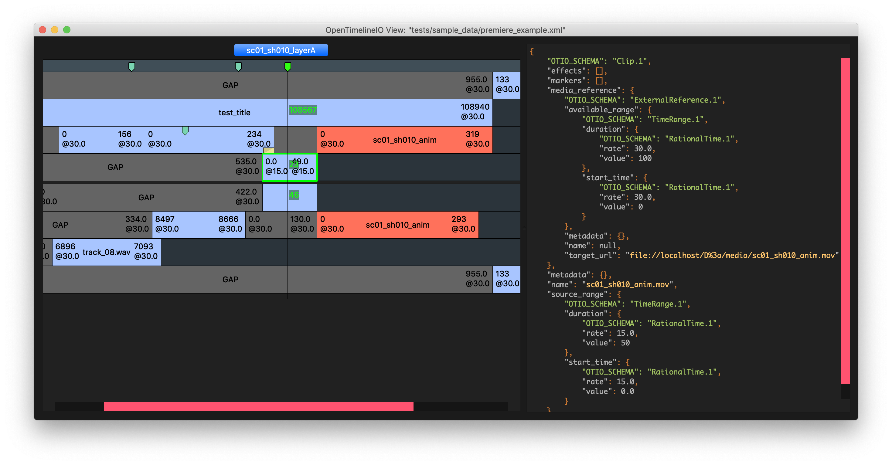

# OpenTimelineView

This is the original timeline viewer application that used to ship with [OpenTimelineIO](https://github.com/AcademySoftwareFoundation/OpenTimelineIO).  


It has since been moved to its own repository as the new [Raven](https://github.com/OpenTimelineIO/raven) viewer has 
been promoted as the main timeline viewing application.  
Having moved OpenTimelineView to its own repository will lower the barrier for contributors to keep this application 
running.

## Install
```shell
pip install opentimelineview
```

## Install and Run via UV
You can install and run OpenTimelineView directly from the source folder like so:
```shell
uv run otioview -h
```

## Usage
```shell
usage: otioview [-h] [-a ADAPTER_ARG] [-H HOOK_FUNCTION_ARG] [-m MEDIA_LINKER] [-M MEDIA_LINKER_ARG] input

Simple otio viewer

positional arguments:
  input                 path to input file

options:
  -h, --help            show this help message and exit
  -a, --adapter-arg ADAPTER_ARG
                        Extra arguments to be passed to adapter in the form of key=value. 
                        Values are strings, numbers or Python literals: True, False, etc. 
                        Can be used multiple times: -a burrito="bar" -a taco=12. (default: [])
  -H, --hook-function-arg HOOK_FUNCTION_ARG
                        Extra arguments to be passed to the hook functions in the form of key=value. 
                        Values are strings, numbers or Python literals: True, False, etc. 
                        Can be used multiple times: -H burrito="bar" -H taco=12. (default: [])
  -m, --media-linker MEDIA_LINKER
                        Specify a media linker. 'Default' means use the $OTIO_DEFAULT_MEDIA_LINKER 
                        if set, 'None' or '' means explicitly disable the linker, and anything 
                        else is interpreted as the name of the media linker to use. (default: Default)
  -M, --media-linker-arg MEDIA_LINKER_ARG
                        Extra arguments to be passed to the media linker in the form of key=value. 
                        Values are strings, numbers or Python literals: True, False, etc. 
                        Can be used multiple times: -M burrito="bar" -M taco=12. (default: [])
```
## License
OpenTimelineView is licensed under the Apache 2.0 license
